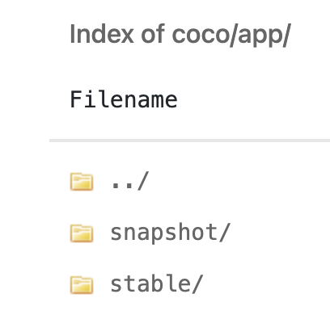

1. Send a PR that updates the release notes "docs/content.en/docs/release-notes/_index.md", and 
   merge it into `main`.

2. Run release command (by @medcl) 

   Make sure you are on the latest main branch, then run `pnpm release`:

   > NOTE: A tag is needed to trigger the [release CI][release_ci].

   ```sh
   ➜ coco-app git:(main) ✗ pnpm release
   🚀 Let's release coco (currently at a.b.c)

   Changelog:
   * xxx
   * xxx

   ✔ Select increment (next version): 

   Changeset:
    M package.json
    M src-tauri/Cargo.lock
    M src-tauri/Cargo.toml

   ✔ Commit (vX.Y.Z)? Yes
   ✔ Tag (vX.Y.Z)? Yes
   ✔ Push? Yes
   🏁 Done
   ```

3. Build & Move Release Package

   1. [Build][ci] the package for this release
   2. @luohoufu moves the package to the stable folder.

      

4. Update the [roadmap](https://coco.rs/en/roadmap) (if needed)

   > You should update both English and Chinese JSON files
   >
   > * English: https://github.com/infinilabs/coco-website/blob/main/i18n/locales/en.json
   > * Chinese: https://github.com/infinilabs/coco-website/blob/main/i18n/locales/zh.json

   1. Add a new [section][roadmap_new] for the new release
   2. Adjust the entries under [In Progress][in_prog] and [Up Next][up_next] accordingly

      * Completed items should be removed from "In Progress"
      * Some items should be moved from "Up Next" to "In Progress"


[release_ci]: https://github.com/infinilabs/coco-app/blob/main/.github/workflows/release.yml
[ci]: https://github.com/infinilabs/ci/actions/workflows/coco-app.yml
[roadmap_new]: https://github.com/infinilabs/coco-website/blob/5ae30bdfad0724bf27b4da8621b86be1dbe7bb8b/i18n/locales/en.json#L206-L218
[in_prog]: https://github.com/infinilabs/coco-website/blob/5ae30bdfad0724bf27b4da8621b86be1dbe7bb8b/i18n/locales/en.json#L121
[up_next]: https://github.com/infinilabs/coco-website/blob/5ae30bdfad0724bf27b4da8621b86be1dbe7bb8b/i18n/locales/en.json#L156