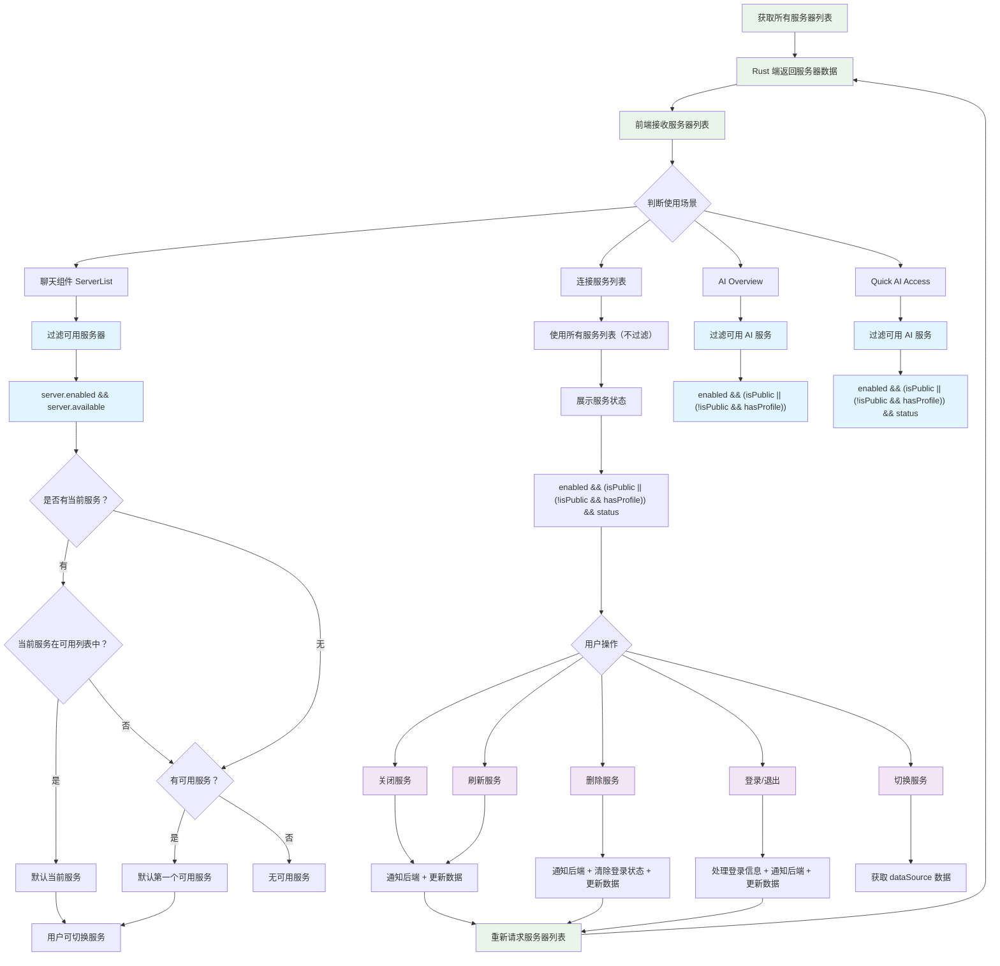

# 请求 App 所有的服务器列表

> 前端没有登录状态，都是通过 rust 端返回的服务器列表中相关字段判断得出的，为了前端状态和 rust 端状态统一，所以如果有数据状态更新，直接通知后端，让后端更新数据，前端重新请求最新数据列表就好。
>相关的字段有：enabled、available、isPublic、hasProfile（hasProfile=!!server?.profile）、status

## 聊天组件用的服务列表 - serverList

1. 需要过滤出可用的服务器：server.enabled && server.available
2. 每个服务展示出服务状态：enabled && (isPublic || (!isPublic && hasProfile)) && status;
3. 如果已经有当前服务，且当前服务在可用列表中，直接默认当前服务
4. 如果没有当前服务，且有可用服务，默认第一个可用服务
5. 用户可以切换当前服务

## 连接服务列表

1. 直接使用所有服务列表数据，不过滤
2. 每个服务展示出服务状态：enabled && (isPublic || (!isPublic && hasProfile)) && status;
3. 点击切换不更新 当前服务，只切换右边展示内容
4. 关闭某个服务，需要通知后端、同时更新所有的服务器数据
5. 刷新某个服务，需要通知后端、同时更新所有的服务器数据
6. 删除某个服务，需要通知后端（同时要清除登录状态）、同时更新所有的服务器数据
7. 登录/退出，前端处理登录信息，需要通知后端（修改登录状态）、同时更新所有服务器数据
8. 切换某个服务，获取（需要传 serverId）、展示对应的 dataSource 数据
9. 刷新 dataSource 数据，传递 serverId

## AI OverView

1. 需要过滤出可用的 AI 服务：enabled && (isPublic || (!isPublic && hasProfile));

## Quick AI Access

1. 需要过滤出可用的 AI 服务：enabled && (isPublic || (!isPublic && hasProfile)) && status;

## 服务器列表管理流程图



## 关键字段说明

| 字段 | 说明 |
|------|------|
| `enabled` | 服务是否启用 |
| `available` | 服务是否可用 |
| `isPublic` | 是否为公共服务 |
| `hasProfile` | 是否有用户配置文件 (`!!server?.profile`) |
| `status` | 服务状态 |

## 核心设计原则

1. **状态统一**: 前端没有独立的登录状态，完全依赖 Rust 端返回的服务器列表字段
2. **数据驱动**: 任何状态更新都通知后端，前端重新请求最新数据
3. **场景区分**: 不同组件根据业务需求使用不同的过滤条件
4. **用户体验**: 智能默认选择和状态展示

## 服务状态判断逻辑

```typescript
// 聊天组件可用服务
server.enabled && server.available

// 服务登录状态显示
enabled && (isPublic || (!isPublic && hasProfile)) && status

// AI Overview 可用服务
enabled && (isPublic || (!isPublic && hasProfile))

// Quick AI Access 可用服务
enabled && (isPublic || (!isPublic && hasProfile)) && status
```

这个流程图清晰地展示了服务器列表在不同场景下的处理逻辑和数据流转过程。
        
